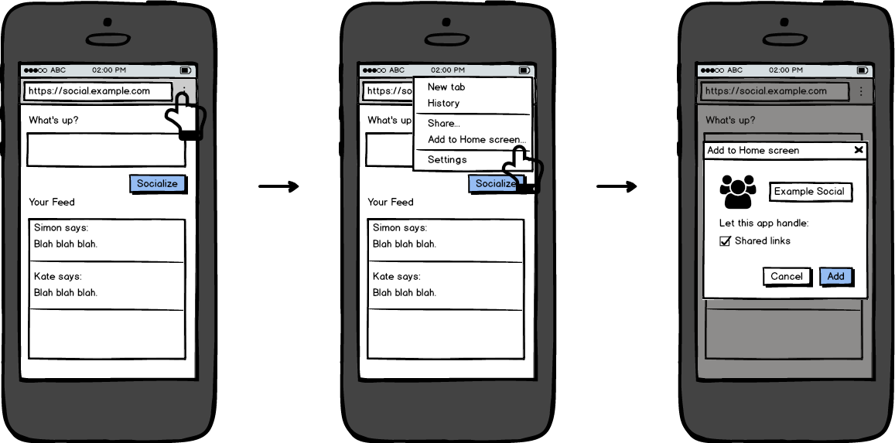

# Ballista User Flows

**Date**: 2016-04-14

This document explores potential user flows interacting with sites using the
Ballista API. Of course, we won't specify a particular user interface for
browsers, but it is important to explore the user experience when considering
such an API.

Naturally, the implementation will need to adapt to the user's operating system.
In these mocks, we try to be as generic as possible regarding host OS, but there
is an Android bias on mobile (simply because there is an obvious mapping from
Ballista actions to Android intents).

## Sharing from web to native on mobile

This section shows how a user would share a link from a website to a native app
of their choice, on a mobile operating system.

[[Image credits](mocks/README.md)]

1. User is browsing a website containing a gallery of photos. User clicks a
   "share" link (denoted by the [generic share
   icon](https://design.google.com/icons/#ic_share)) for a specific photo. The
   website calls `navigator.actions.performAction('share')` (see
   [code](explainer.md#sharing-requester)) with a custom Subject and Message (in
   the common case, the message is a URL pointing at the selected photo).
2. A modal picker dialog is shown to the user, with a set of native applications
   and system actions (e.g., "Gmail", "Facebook", "Copy to clipboard"). On
   Android, this is the system intent picker, but the implementation may differ
   between browsers and operating systems. The user picks "Gmail".
3. The Gmail native app opens, and is pre-populated with the Subject and
   Message.

## Registering a website as a handler on mobile

This section shows how a user would register one of their favourite websites to
receive share actions from other websites and native apps.

1. User visits a social networking website. The site has an `"actions"` section
   in its [web manifest](https://w3c.github.io/manifest/), declaratively
   specifying that it can receive share actions (see
   [code](explainer.md#share-handler)).
2. User indicates to the browser that they wish to register the site. **For
   discussion:** We have not determined whether this should be a) something the
   site can trigger programmatically through a JavaScript API, b) something the
   user must trigger through the browser UI, or c) something the browser
   automatically prompts for in response to some stimulus (e.g., user visiting
   the site many times), or a combination of the above. At the moment, we are
   assuming there is no API and registration is at the discretion of the
   browser/user. In Chrome, we envision the "Add to Home screen" button on the
   browser drop-down menu will provide an adequate signal to register the
   handler.
3. The user confirms registration of the site for the purpose of "Shared links"
   (this string is tailored by the browser specifically for each verb the
   handler is requesting).

The site now shows up in Ballista share pickers, and potentially also (depending
on the operating system) in the system's native share picker.

## Sharing from web to web on mobile

This section revisits the original share flow, after having registered the
"Example Social" website as a handler.

1. As before, the user clicks "share" from a web page.
2. The intent picker is shown. This time, "Example Social" appears in the list
   of applications. Here, it is shown above a horizontal line, which is how it
   would appear in Android 6.0+ using the [Direct
   Share](http://developer.android.com/about/versions/marshmallow/android-6.0.html#direct-share)
   feature to dynamically insert handlers into the system intent picker. The
   user picks "Example Social".
3. The Example Social web page opens in a new browser tab. It is pre-populated
   (via an event being delivered to the page's service worker; see
   [code](explainer.md#share-handler)) with the Subject and Message in the post
   text field.

Share events coming from native applications could also be delivered to web
applications in the same way.

This flow will be different depending on the capabilities of the operating
system. There are three broad approaches possible in descending order of
preference:

1. Handlers are inserted into the system share picker dialog, as shown above.
   This allows share events coming from native applications to be delivered to
   web applications via the same mechanism. This approach should be possible on
   Android 6.0 (M) and above.
2. The browser presents its own picker UI with all web handlers, as well as a
   "Share to system" button. Clicking "Share to system" triggers the system
   share picker dialog. This approach does not allow for native-to-web sharing,
   and also presents additional friction for web-to-native sharing.
3. The browser presents its own picker UI with all web handlers, and no way to
   share to native apps. This approach would be taken on platforms with no
   native sharing infrastructure (desktop operating systems).

**Potential pitfall**: With approach #1, we may need a way to filter out what
the user will perceive as duplicate entries: a native app and web app of the
same thing (e.g., Facebook), or the same web app registered with two browsers.
At least on Android, the web apps will be badged with the browser's icon.

For more technical details on integrating with native apps, see [Native
Integration Story](native.md).
